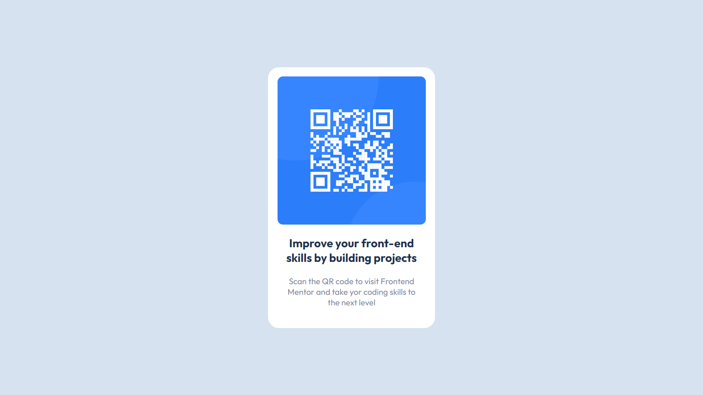

# qr-code-component

QR code component utilizando HTML e CSS.

## Preview

## Tecnologias

- HTML
- CSS

## Informações

- Uso do padrão BEM de CSS

## Link de acesso

<a href="https://udanielnogueira.github.io/qr-code-component/" target="_blank">QR Code component</a>

## Link do desafio

<a href="https://www.frontendmentor.io/challenges/qr-code-component-iux_sIO_H" target="_blank">Desafio QR Code component</a>
